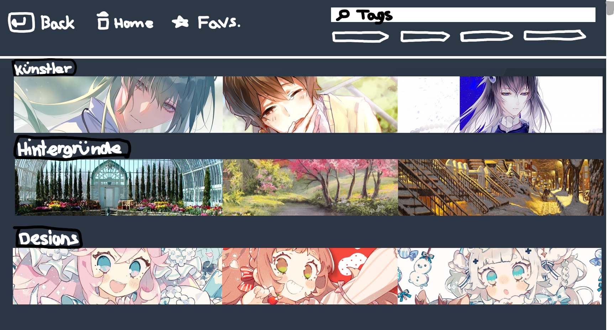
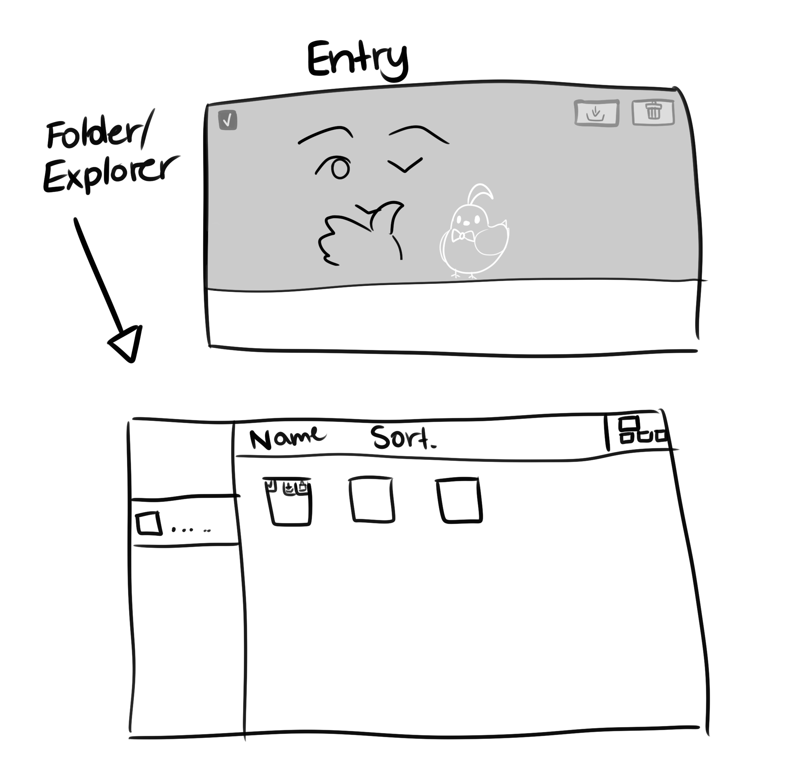
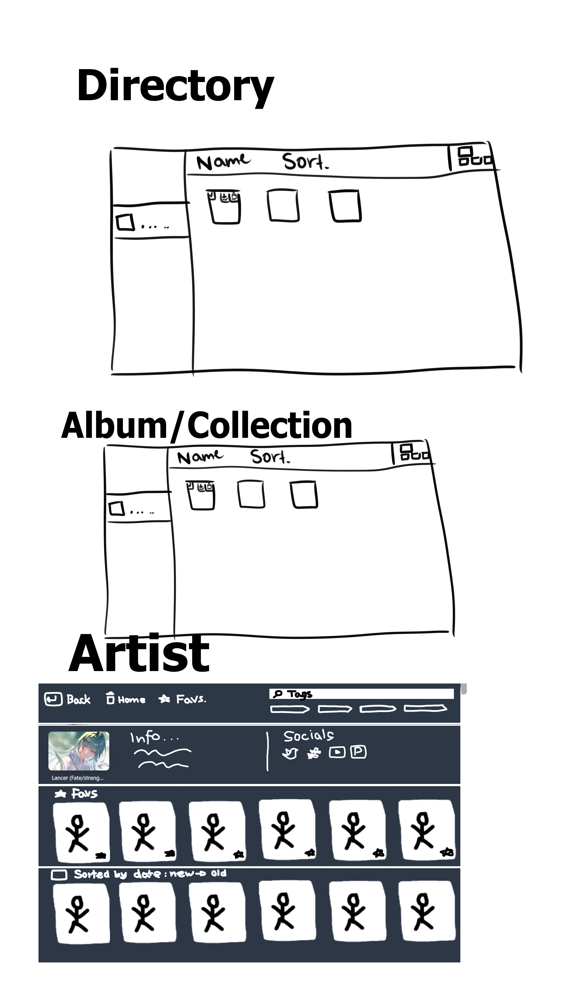
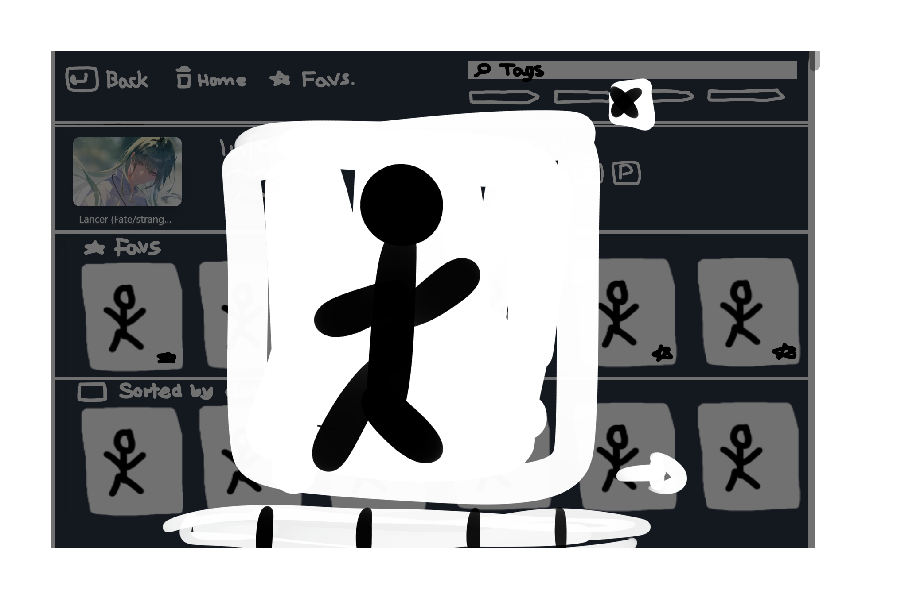
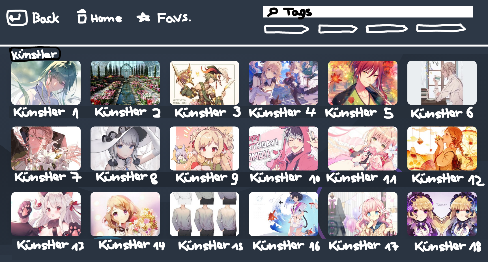

# Sourcerer
## Concept

Figure 1: A Directory

The goal of this project is to simplify the process of looking up, finding, saving and managing art references.

This document holds information on how this program should work at some point.

## Main Window
The main window consists of the side-bar (a tree-view of Sourcerer) and the main panel which contains the explorer.

The side-bar can be showed or hidden.

Capabilities of the program:
  - Open With File Types
  - Supported file-types
    - Pictures
      - `.png`
      - `.jpg`
      - `.svg`
    - Videos
      - `.mp4`
    - Music
      - `.m4a`
      - `.mp3`

## Explorer
The core component of this program has to be the explorer as all information and pictures are displayed and managed in it.

In the further document all files, pictures, pieces of texts, links etc. are being called "entry".

The explorer provides the ability to view, delete, download and manage folders and entries.

Capabilities of the explorer:
  - Show entries and containers
  - Drag-In
  - Drag-Out
  - Paste from clipboard
  - Move
  - Copy
  - Open Viewer (Diashow)
  - Sort by specific property (date, author, title etc.)
  - Search

Figure 2: The explorer and an entry

### View-Modes
The explorer must provide the ability to navigate through the file-system and to manage entries. It should provide different view-modes (such as list, detail, tiles, big picture).

One example of a view-mode we definitely want to see implemented is the following:

Figure 3: An example of a directory

### Items
Entries and containers are called "items". An item must provide following capabilities:
  - Add tags
  - Move
  - Delete
  - Copy
  - Add album
  - Show in file explorer

#### Entry
The user must be able to save entries for offline use, delete entries and check them in order to perform bulk operations.

Capabilities of an entry:
  - Save offline
  - Drag-In
  - Drag-Out

### Containers
A container is a component that contains entries and/or other containers. A container also contains informatin on how its thumbnail shal be displayed.

Figure 4: The different kinds of containers

Basically there shall be three different kinds of containers:

#### A: Directory
A directory represents a folder on your file-system. The user can freely move, sort and manage entries and container inside directories.

#### C: Album
An album is a collection of entries. As the album does not represent a file-system directory; entries can be added to as many albums as you want.

Just like in directories, the user can freely move, sort and manage entries.

#### B: Filter/Search/Collection
A filter is a dynamically created container which shows certain pictures based on a query.

Unlike in directories or albums, the user neither can order no move the displayed entries. Even though he is able to manage or delete them. (Probably implement custom sorting at some point).

##### Custom Views
Custom views can be added using plugins, some basic views are provided by the program out of the box.

One example is the artist-view which will be shipped with the program:

Figure 5: An example of a custom view

### Viewer
Another important component is the viewer. It is opened as an overlay in front of the main window and allows you to view all items in a container.

The viewer should mainly focus on a single item. It shall display tiny thumbnails of the other items inside the container and allow you to navigate through the container (by clicking on arrow-icons or pressing the arrow-keys).

Maybe also display a peek of the next and previous item.

Figure 6: The draft of the viewer

### Additional Drafts

Figure 7: A custom container containing artists
